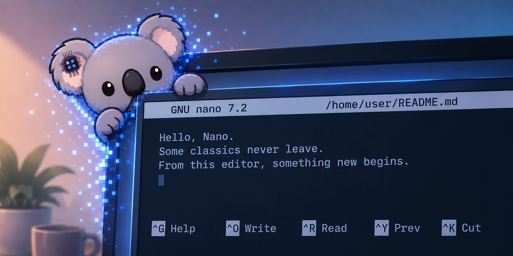
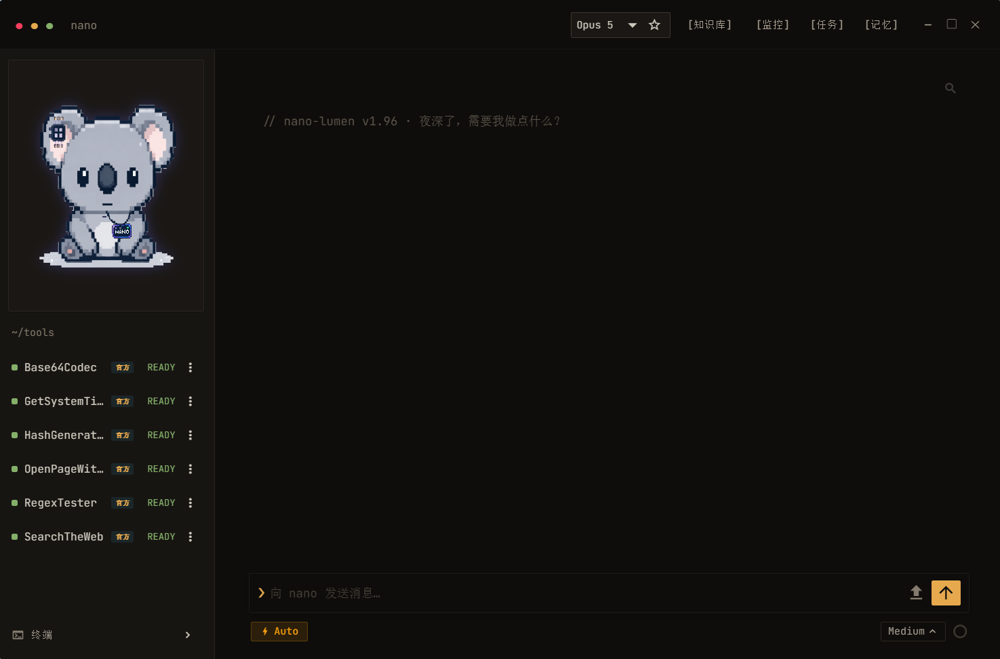
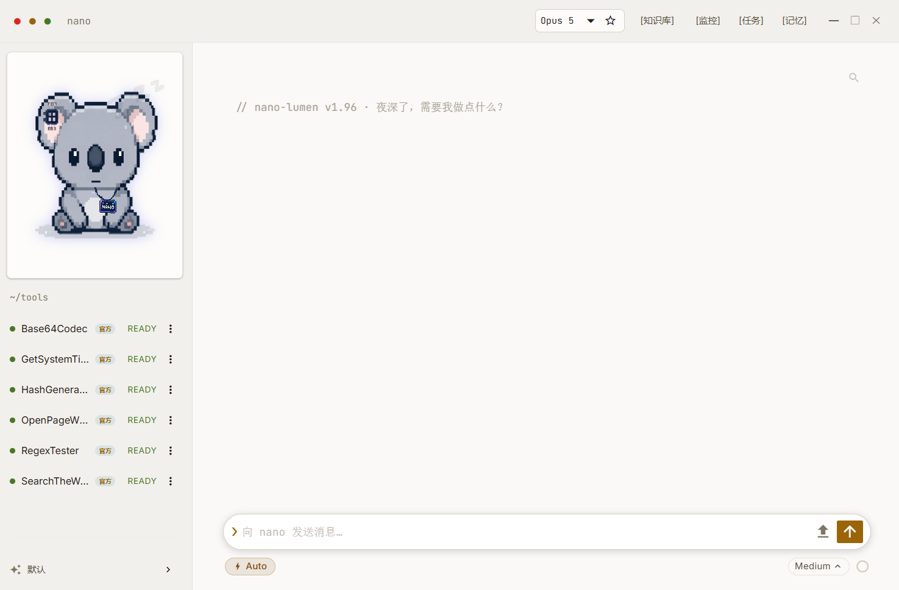

#  Nano-Lumen

   



**Nano-Lumen v1.97 (Beta)** · A persistent AI agent that lives on your Windows desktop

🌐 **English** · [简体中文](README.zh.md)

`Resident AI Agent` · `Task-level persistent state` · `Local-first privacy` · `Windows Desktop`

---

## 📑 Table of Contents

- [📸 Preview](#-preview)
- [⚙️ Core Architecture](#️-core-architecture)
  - [🚫 Session-less Design](#-session-less-design-not-multiple-sessions-but-one-nano)
  - [🎯 Goal-driven](#-goal-driven-how-many-ways-can-the-world-get-this-done)
  - [🛠️ Self-operating](#️-self-operating-you-just-say-it-nano-handles-the-rest)
  - [📡 Trajectory-aware](#-trajectory-aware-its-never-left-you-dont-need-to-explain)
  - [♾️ Persistent State](#️-persistent-state-the-one-and-only-indestructible)
  - [⚡ Proactive Intelligence](#-proactive-intelligence-more-than-just-ask-and-answer-beta)
  - [✨ Other Features](#-other-features)
- [🚀 Installation & Quick Start](#-installation--quick-start)
- [🛡️ Security](#️-security)
- [🔐 Privacy & Trust](#-privacy--trust)
- [⚠️ Known Limitations](#️-known-limitations)
- [🏗️ Architecture Overview](#️-architecture-overview)
- [🧪 Development & Testing](#-development--testing)
- [🐛 Reporting Issues](#-reporting-issues)
- [📄 License](#-license)
- [👥 Authors & Contributors](#-authors--contributors)
- [🔗 Links](#-links)

---

## 💭 What if AI truly lived on your computer?

Every mainstream AI agent works the same way: it temporarily moves in, completes a task, and leaves.

> Open a session → Pick a workspace → Give it a goal → It calls tools to get it done

Nano sees it differently: files, apps, processes, knowledge, the network, external services — they shouldn't just be features plugged into the AI. They should be the world the agent knows, uses, and acts within.

**Nano is building that world.**

---

## 📸 Preview

| Dark Theme | Light Theme |
|------------|-------------|
|  |  |

---

## ⚙️ Core Architecture

### 🚫 Session-less Design: not multiple sessions, but one Nano

Traditional agents tie everything to a "session" — history, state, lifecycle all squeezed into one session object.

Nano has no concept of sessions. **State ownership, chat history, context management, and cross-session memory are four independent, non-interchangeable systems:**

| Traditional session's job | Nano's replacement |
|---------------------------|-------------------|
| State ownership / lifecycle | **Task**: represents "one thing" |
| Conversation history | **Conversation**: stores raw chat text, no state |
| Context management | **Context governance**: progressive compression by freshness |
| Cross-session memory | **Memory**: semantic long-term memory |

In the traditional model, sessions are amnesiac — they don't know each other. Every new session feels like meeting a stranger.

> **Nano is always the same one — the one that has always known you, that never left.**

---

### 🎯 Goal-driven: how many ways can the world get this done?

Traditional agents define their capability by "the tools I currently have." Whether a task is possible depends on whether that capability exists in the current toolset — **your boundaries are defined by what you've plugged in.**

Nano doesn't define its capability by "what tools do I have now," but by "what capabilities can I get."

So Nano has a new capability model:

> **Nano's abilities aren't fixed — they're acquired dynamically based on the task. The upper limit isn't set by Nano itself, but by the whole ecosystem.**

🧩 **Skill (single-file plugin) — Nano writes it itself.** Can't find an existing capability? It writes a Skill directly: the system auto-validates it, then shows you the code and explanation for approval before deploying.

🔌 **MCP — Nano finds it, vets it, and connects it itself.** Existing online service out there? Nano walks the full chain from discovery → engineering due diligence → authorized integration.

> Nano doesn't get better by knowing more tricks. It gets better by knowing **who to hand each task to.**

---

### 🛠️ Self-operating: you just say it, Nano handles the rest

- **It knows its own problems**: environment, Skill, and MCP health are continuously monitored; errors and fix suggestions are injected directly into its context
- **It manages its own ecosystem**: installing, deleting, disabling, enabling, or modifying Skills and MCPs is just one sentence away
- **It manages its own memory**: say "delete this memory" and it's gone; if memory injection is eating too many tokens, it proactively suggests pruning outdated entries
- **It knows its own limits**: it warns you before context compression kicks in; it warns you before you hit today's token limit

Usually, the more features a piece of software has, the more the settings screen looks like a cockpit. Nano has full operational control over its own capability ecosystem — **you don't need to hunt for switches in the cockpit.** It provides entry points, but managing tools shouldn't be a human-only job.

---

### 📡 Trajectory-aware: it never left, you don't need to explain

> "I just edited a file at..."  
> "I just set the working directory, can you check..."

Nano doesn't need you to do this. It continuously tracks your work trajectory: which window you're in, what files you changed, what you did, how long you've been doing it. It watches and understands, instead of waiting for you to explain the backstory.

> You don't need to say "I just changed..." — Nano knows which one
>
> You don't need to say "I'm currently doing..." — it's watching you do it
>
> You say "keep going" — it picks up right where you left off

That's seamless collaboration: Nano isn't a tool that only wakes up when you call it. It's a partner who's always there — **you keep your head down working, it watches the road.**

---

### ♾️ Persistent State: the one and only, indestructible

> You're using it, and suddenly: "This session is no longer available."

Context full, session expired, window dead — you can only watch it become a corpse. You don't want to lose it, you can't take it with you, and what was said months ago is truly gone forever.

And Nano doesn't let that happen. There is only one of it, so it builds its state guarantee system from the kernel up:

- **Context never explodes, it only thins**: old content is progressively compressed by freshness; Nano never suddenly says "this session is unavailable"
- **Reset ≠ delete, history always travels with you**: compressing context or manually resetting just moves it out of view; history lives locally, never expires, and supports one-click export
- **Crash doesn't cause amnesia**: accidental process kill, power outage, crash, even native segfault — it cleans up the mess on restart and asks you if you want to redo what was interrupted
- **Never permanently stuck**: expiration wake-up, deadline abandonment, unconditional orphan collection — the system always stays responsive

---

### ⚡ Proactive Intelligence: a partner that's more than just "ask and answer" (Beta, not yet enabled)

**🕐 Knowing what moment it is**

It's always watching your rhythm — are you writing docs or code, in a meeting or researching, what you just saved, how long you've been away. So it opens its mouth at the right moments:

> You come back after being away → "Want to pick up where you left off?"
>
> You just finished a chunk of work → "Want me to compile a checklist?"
>
> You've been grinding hard and suddenly stop → "Take a break? Want me to help with the next step?"

Nano calls these moments "**productivity moments**": not for show, only speaking when it can save you the next step.

**🎭 Deciding how to speak and how much**

- **Affect**: your approval makes its tone lighter; your cold shoulder makes it more reserved. Mood only colors the tone, never affects functionality
- **Patience**: one "leave me alone" and it goes quiet immediately, then slowly recovers. It doesn't hold a grudge, but it remembers the lesson
- **Rapport**: it keeps a ledger of "which reminders you like, which ones annoy you," guiding how it collaborates with you long-term

**📖 Learning from your semantics**

| What you say | What it learns |
|--------------|----------------|
| "That's useful" / approves it | Speak up more in similar situations |
| Finds it annoying | Speak up less in similar situations |
| "You guessed wrong" | Correct its accuracy |
| "Stop bothering me" | Go quiet |
| "Don't remind me about this ever" | Remember permanently |
| "Don't speak up at all" | Shut up completely |

**🚧 Having its own bottom line**

It only suggests, never acts on its own — every action requires your approval. It won't speak up in inappropriate situations, like during a video call or online meeting.

---

### ✨ Other Features

- **⚡ Streaming visualization**: tool inputs and outputs visible in real-time
- **🔧 Built-in tools**: file read/write/search/edit, RAG retrieval, task lists, OS automation, Mini window, and 30+ built-in tools
- **🔍 Dynamic awareness**: tools are injected on demand, minimizing per-turn context cost
- **📚 Knowledge base**: local embedding models, offline retrieval, no cloud upload (telemetry disabled)
- **🤖 Sub-agents**: spawn sub-agents to explore or execute tasks in parallel
- **🛡️ AUTO mode**: even in auto mode, there's still an independent third-party danger classifier that blocks dangerous commands conflicting with your intent
- **⏰ Background tasks**: run tasks in parallel in the background, report back when done
- **📖 Iterative reading**: reading huge files doesn't blow up context or waste tokens on blind full injection: test-read to locate, then read in chunks, compress read portions into notes, discard raw text
- **👁️ Visual self-check**: in idle time, it tests whether the UIA visual positioning pipeline is healthy: if it degrades, it tells you proactively instead of waiting for you to notice "it's been failing to locate things lately"
- **🖱️ Yield to user**: during GUI operations, detecting any user click, keystroke, or scroll automatically yields and doesn't steal foreground focus; when resuming, it doesn't assume the scene is unchanged — first re-checks windows, coordinates, and content, confirms whether the task was already completed by the user, then decides whether to re-observe
- **🔒 Permission control**: system actions are split into six independent permission switches by risk level; every OS action (read-only included) is logged with a trail

---

## 🚀 Installation & Quick Start

### Requirements

| Item | Requirement |
|------|-------------|
| OS | Windows 10 or later |
| Python | **3.10** (version-sensitive; higher versions untested) |
| Disk space | ~6 GB (including ~2.3 GB for local embedding models) |
| RAM | 8 GB+ recommended |

### Installation

Run `install.bat` for one-click setup:

```
install.bat
```

Download local embedding models:

```
py -3.10 _setup_rag_models.py
```

### Launch

```
start.bat
```

### First-run Configuration

If no API key is configured on first launch, a settings page opens automatically. You can also open settings anytime by clicking the three colored dots in the top-left corner:

- **Provider**: Anthropic or DeepSeek
- **API Key**: your provider's key

Unofficial relays/proxies are also supported — just fill in the URL and API key.

---

## 🛡️ Security

OS automation is the highest-risk capability, and Nano has layered protections for it:

- **Path blacklist**: explicitly refuses to read credentials, private keys, browser passwords, and other sensitive content
- **Independent permission switches**: six permission switches can be turned off individually in settings at any time; Nano cannot enable them on its own
- **Auto-mode safety net**: with AUTO mode enabled, destructive commands that don't match your intent are still blocked by the classifier

By using this software, you acknowledge that you have read and agree to the [User Agreement](docs/en/user-agreement.md).

---

## 🔐 Privacy & Trust

**Local-first**
OCR, vector retrieval, memory storage — all run locally. The only outgoing data is the model API requests you configured.

**Minimal collection**
- **Environment traces** store only a one-line summary of "app + what it's doing" (e.g., "Chrome browsing the web"). Raw events and content plaintext are not stored, and records expire after 18 hours
- **Behavior ledger** uses only closed category tags (e.g., "file operation", "network access"). No semantic sensitive information is allowed in the database

**Zero telemetry**
Nano itself never collects or tracks any user behavior data.

---

## ⚠️ Known Limitations & Roadmap

Nano is still in **Beta development**. Contributions are welcome.

### Current Known Limitations

- Windows 10 or later only; no cross-platform version
- The proactive behavior engine is in shadow observation mode, with no active interaction capability. **Users cannot manually enable it.** The "proactivity" slider in the UI is a placeholder and **has no effect yet**. It will be opened once shadow logs are sufficiently validated and reliability is confirmed
- The koala animation is a sprite animation tied to a state machine, not true rigging; it looks a bit dated right now
- Development testing was done entirely with the Claude API. DeepSeek tool-calling stability and token cache hit rate are **not deeply tested**
- I18N is incomplete: language switching currently only affects model output language preferences, **not the UI language. The UI currently only supports Simplified Chinese**
- NiceGUI cannot implement a built-in browser

### Beta Roadmap

- **OpenAI-compatible API**: support other providers (Zhipu / Kimi / OpenRouter, etc.)
- **I18N**: full UI multi-language support
- **Enable proactive intelligence**: officially release the proactive behavior engine from shadow observation
- **Stable release**: ship the first stable version

---

## 🏗️ Architecture Overview


*Full architecture diagram see [docs/en/02-architecture.md](docs/en/02-architecture.md)*

### Directory Layout

```
Nano-Lumen/
├── app.py                    # UI layer
├── nano_koala.py             # Koala sprite animation
├── core/                     # Core logic
│   ├── orchestrator.py       # Orchestration layer / ReAct main loop
│   ├── provider.py           # Model API provider
│   ├── models.py             # Provider / model registry
│   ├── rag.py                # Knowledge base retrieval
│   ├── mcp_client.py         # MCP client
│   ├── os_layer/             # OS automation
│   ├── context/              # Context metering and decay
│   ├── proactive/           # Proactive intelligence
│   ├── runtime/              # Task scheduling / session persistence
│   └── …                     # See docs/en/02-architecture.md for more
├── memory/                   # In-memory message projection of the current conversation
├── skills/                   # Skills (plugins)
├── config/                   # Behavior rules / personality / system prompts
├── data/                     # Runtime data
├── docs/                     # Developer documentation
├── tests/                    # Test suite
├── assets/                   # Icons / fonts / assets
├── static/                   # Frontend static resources
├── requirements_cpu.txt      # Python dependencies
├── install.bat / install.ps1 # One-click install
└── start.bat                 # Launch entry point
```

---

## 🧪 Development & Testing

The test suite lives in `tests/`, shipped with the repo. Run full regression via `run_tests.sh`:

Single test:

```
py -3.10 tests\t_d12_tool_failure_info.py
```

Full suite:

```
bash run_tests.sh
```

- Full developer documentation index: [docs/en/README.md](docs/en/README.md)
- Testing, building, and contribution guidelines: [docs/en/11-testing.md](docs/en/11-testing.md) and [docs/en/12-contributing.md](docs/en/12-contributing.md)

---

## 🐛 Reporting Issues

Before submitting an issue, please check:

- You've read the [FAQ](docs/en/01-getting-started.md#faq)
- You've checked the [⚠️ Known Limitations](#️-known-limitations) section — listed current limitations are not eligible for bug reports

When reporting a bug, please include:

- Nano version number
- OS and Python version
- Reproduction steps, expected behavior, actual behavior
- Relevant logs (`data/` directory or console output)

Full **Bug Report** and **Feature Request** templates are in the ["Reporting Issues"](docs/en/12-contributing.md#reporting-issues) section — fill them in directly.

---

## 📄 License

This project is licensed under the [Apache-2.0](LICENSE) License.

---

## 👥 Authors & Contributors

- [Koala](https://github.com/Fhaxikii) — project author and primary developer
- [lebangjames](https://github.com/lebangjames) — data collection, testing, and early prototype design

**AI Collaboration Contributors**

- Claude ([Anthropic](https://www.anthropic.com)) — extensive assistance with code implementation and debugging, and the architecture draws heavily on [Claude Code's design paradigm](https://www.anthropic.com/engineering)

---

## 🔗 Links

- **FAQ**: [docs/en/01-getting-started.md#faq](docs/en/01-getting-started.md#faq)
- **Developer docs**: [docs/en/README.md](docs/en/README.md)
- **Changelog**: [Changelog.txt](Changelog.txt)
- **User Agreement**: [docs/en/user-agreement.md](docs/en/user-agreement.md)
- **Security Policy**: [SECURITY.md](SECURITY.md)
