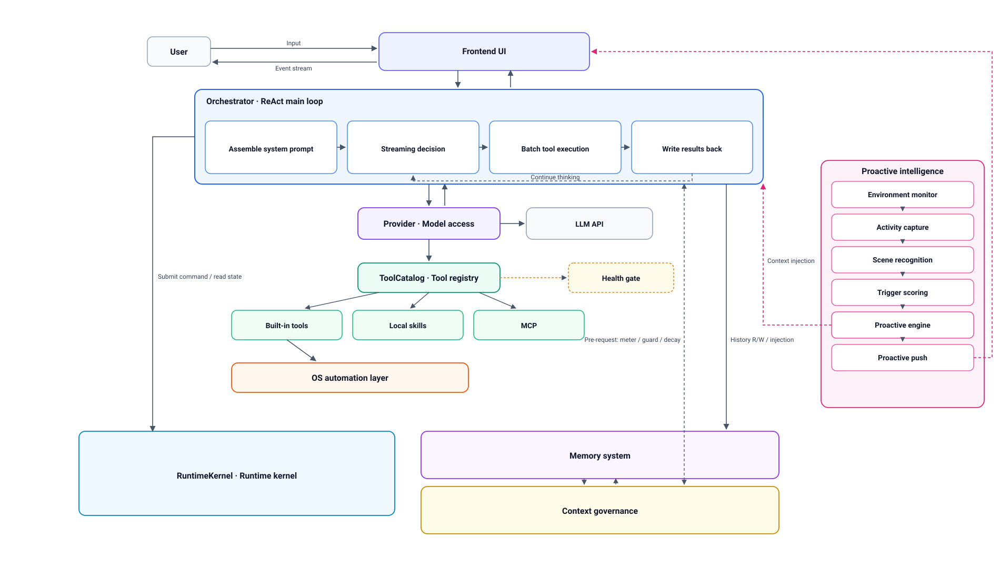

# 02 · Architecture

**What this page covers**: the process structure, module layout, and the path a user message travels from input to reply.  
**After reading it you can**: decide which module a change belongs in, and understand the terms used throughout the other pages.  
**Prerequisites**: [01-getting-started.md](01-getting-started.md).

> Language: [中文](../zh/02-architecture.md) · English

---

## Process structure

Nano is a single-process desktop application:



The UI layer and the orchestration layer live in the same process and
communicate through async generators passing events.
The UI never calls the model or tools directly; everything goes through the
orchestration layer.

## Modules

### UI layer

`app.py`. Window construction, chat area, four side drawers, the settings
panel, and all style definitions. See [09-ui.md](09-ui.md).

### Orchestration layer

`core/orchestrator.py`. Organizes one conversation turn: assembles available
tools, builds the context, drives the model's reasoning-and-tool-call loop,
and pushes progress events to the UI.
It is the largest single file in the project and the confluence point for
most cross-module logic.

### Model access layer

| File | Responsibility |
|---|---|
| `core/provider.py` | Actual communication with model APIs: streaming, tool calls, usage accounting |
| `core/models.py` | The fact table for vendors and models: which vendors exist, which models each has, what each supports |
| `core/usage.py` | Usage and cost accounting |

Vendor facts come from `core/models.py` only; model names are not hardcoded
anywhere else.

### Tools and capabilities

| Directory | Contents |
|---|---|
| `core/tools/` | Declarations of the built-in tools and catalog assembly |
| `skills/` | Skills — pluggable tools that exist as files. See [04-writing-a-skill.md](04-writing-a-skill.md) |
| `core/mcp_client.py` | MCP client. See [05-mcp-servers.md](05-mcp-servers.md) |
| `core/os_layer/` | Desktop automation: command execution, file operations, window and input control, screen vision. See [06-os-automation.md](06-os-automation.md) |

### Storage and memory

| Directory | Contents |
|---|---|
| `memory/` | Conversation history storage |
| `core/context/` | Context governance: metering, budgeting, layered decay, digesting. See [07-memory-and-context.md](07-memory-and-context.md) |
| `core/rag.py` | Knowledge-base ingest and retrieval. See [08-knowledge-base.md](08-knowledge-base.md) |
| `core/runtime/` | Runtime facilities: task scheduling, background jobs, session persistence, image storage |

### Others

| File | Responsibility |
|---|---|
| `core/health.py` | Capability health registry. When a capability is unavailable, it decides how the outside world is told |
| `core/schema.py` | Data structures and enums of the skill protocol |
| `core/registry.py` | Skill discovery, loading, and reloading |

## The path of one message

```
User input
   │
   ├─ UI layer collects: text, images, temp files, references
   │
   ├─ Written to conversation history (memory)
   │
   ├─ Orchestration layer assembles this turn's context
   │     · system prompt and persona
   │     · available tool catalog (built-in + skills + MCP, loaded on demand)
   │     · conversation history (the context-governed version)
   │
   ├─ Reasoning and tool-call loop
   │     model output → if it contains tool calls → execute → feed results
   │     back → reason again; the loop ends when the model produces final text
   │
   ├─ Events keep streaming to the UI along the way (tool cards, status, logs)
   │
   └─ Final reply is written to conversation history and rendered
```

Tools are not all resident by default. The model sees a slim capability
catalog; the full definition of a tool is fetched via a loader tool only when
its parameters are needed. This keeps the fixed overhead of every turn low.

## Concepts you need to understand

**Skill**
A tool that exists as a single Python file. Drop it into `skills/` and it is
discovered and loaded, no framework changes needed.

**Tool card**
The collapsible UI block that shows one tool call: tool name, arguments,
result.

**Risk level**
How dangerous a desktop automation action is, as an integer. It decides
whether an action requires user authorization. The computation is described
in [06-os-automation.md](06-os-automation.md).

**Anything bound to a Task must carry its own fallback**
Anything whose lifecycle is attached to a Task (the scratchpad, "this turn
only" authorizations, per-task counters, the in-progress display) must NOT
treat the Task's end as its only invalidation condition. It needs a second,
independent fallback: a TTL, a count cap, or startup-time cleanup.

The reason: a Task's end depends on the model remembering to close it out,
and models forget. What forgetting breaks differs per item — an undeleted
scratchpad just leaves a lump in context, an uncleared counter just makes a
number meaningless, but **a "this turn only" authorization that never expires
is a security problem**.

`os.temp_auto` and `os.gui_session` in `core/runtime/oslease.py` are the
positive examples: each has two independent exits — an explicit revoke and a
startup-time sweep — and neither depends on the Task being properly closed.

**Context layers**
In long conversations, older content is progressively distilled and
compressed instead of being truncated, to control how much is sent to the
model each turn. Layers are numbered L0 to L4; L0 is verbatim text and larger
numbers mean more condensed. See [07-memory-and-context.md](07-memory-and-context.md).

---

## How to verify you understood it

Structural understanding cannot be verified directly. The test is: take a
concrete problem and say which file it belongs in. For example:

- "The message text shown when a tool call fails" → UI layer, `app.py`
- "An action that should require authorization doesn't pop the dialog" →
  risk computation in `core/os_layer/dsl.py`
- "The model list didn't update after switching vendors" → `core/models.py`
  and the dropdown refresh in `app.py`

If you can locate the file for questions like these, this page has done its
job.

---

← Back to [README](README.md)
