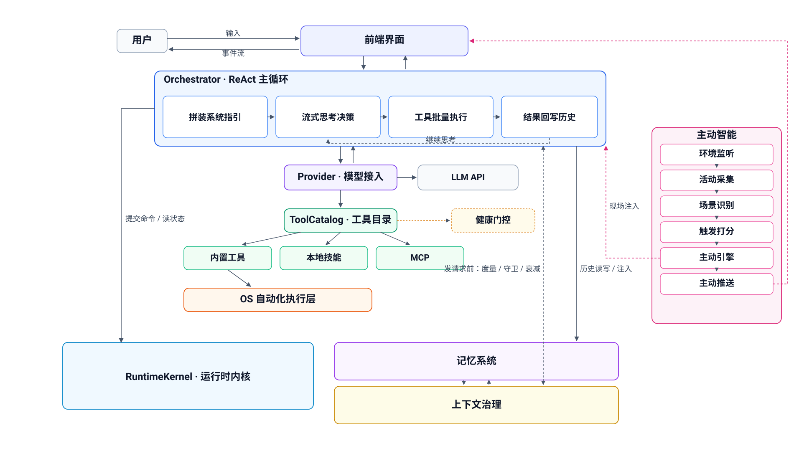

# 02 · 整体结构

**这篇讲什么**：Nano 的进程结构、模块划分，以及一条用户消息从输入到回复所经过的路径。  
**读完你能做什么**：判断一个改动应该落在哪个模块，并理解后续各篇所用的术语。  
**前置**：[01-getting-started.md](01-getting-started.md)。

> 语言：中文 · [English](../en/02-architecture.md)

---

## 进程结构

Nano 是一个单进程的桌面应用：



界面层和编排层在同一个进程内，通过异步生成器传递事件。
界面不直接调用模型或工具，全部经过编排层。

## 模块划分

### 界面层

| 文件 | 职责 |
|---|---|
| `app.py` | 窗口构造、聊天区、四个侧边抽屉、设置面板、以及所有样式定义。详见 [09-ui.md](09-ui.md) |
| `nano_koala.py` | 考拉精灵图动画 |

### 编排层

`core/orchestrator.py`。负责组织一次对话：装配可用工具、构造上下文、
驱动模型的推理与工具调用循环、把过程事件推给界面。
它是整个项目中最大的单个文件，也是绝大多数跨模块逻辑的汇合点。

### 模型接入层

| 文件 | 职责 |
|---|---|
| `core/provider.py` | 与模型 API 的实际通信，包括流式、工具调用、用量记账 |
| `core/models.py` | 厂商与模型的事实表：哪些厂商可用、每个厂商有哪些模型、各自支持什么；三个内部角色槽也在这里解析 |
| `core/usage.py` | 用量与费用统计。注意：上下文厚度归 `core/context/meter.py`，两边不混用 |

厂商相关的事实统一从 `core/models.py` 取，不在其他地方硬编码模型名。

### 工具与能力层

| 文件 / 目录 | 职责 |
|---|---|
| `core/tools/catalog.py` | 统一工具目录：「一个工具到底是什么」的唯一权威。新增工具在这里登记一次，感知文案、调度策略、执行绑定自动派生 |
| `core/tools/builtin.py` | 全部内置工具的唯一一处声明 |
| `skills/` | 技能，即以文件形式存在的可插拔工具。详见 [04-writing-a-skill.md](04-writing-a-skill.md) |
| `core/registry.py` | 技能的发现、加载与重载 |
| `core/mcp_client.py` | MCP 客户端。详见 [05-mcp-servers.md](05-mcp-servers.md) |
| `core/mcp_discovery.py` | MCP 发现链的第一环：检索官方 MCP Registry |
| `core/reading.py` | 迭代阅读：大文件先试读定位、再分片深读、读完记结论丢原文 |
| `core/code_scan.py` | 代码副作用扫描 |
| `core/temp_exec.py` | 临时执行通道：跑一段用完即弃的 Python，子进程隔离 |
| `core/os_layer/` | 桌面自动化。详见 [06-os-automation.md](06-os-automation.md)，文件拆分见下文 |

#### `core/os_layer/` 文件拆分

| 文件 | 职责 |
|---|---|
| `dsl.py` | OS 指令契约：封闭的动作枚举、风险地板与动态升级、硬编码状态转移表 |
| `dispatch.py` | 调度入口：校验 → 定位前置 → 授权门禁 → 路由执行 → 写审计 |
| `executor_low.py` | 只读执行器：截屏、系统信息、读注册表、窗口树、鼠标坐标 |
| `executor_write.py` | 系统 API 写动作：窗口/音量/进程/文件读写/剪贴板/打开 URL |
| `executor_action.py` | 鼠标键盘动作 + 双保险急停 |
| `executor_vision.py` | 视觉定位器：UIA 控件树优先，拿不到时降级到多模态视觉模型 |
| `longcmd.py` | 长命令后台化：命令活过工具调用，stdout 可回看 |
| `cmd_classifier.py` | Auto 模式的危险命令判定 |
| `window_binding.py` | 当前操作窗口绑定：Nano 知道自己在操作哪个窗口 |
| `fileedit.py` | `edit_file` 的纯计算部分：算 diff，不直接写盘 |
| `filesearch.py` | `search_files`：文件名通配 + 内容 grep，合成一个只读工具 |
| `pathpolicy.py` | 文件工具的路径黑名单 |
| `safety.py` | 授权作用域与步数计数 |
| `audit.py` | 全量 OS 操作流水 |
| `canary.py` | 空闲时自测视觉定位链路，退化主动告警 |

### 存储与记忆层

| 文件 / 目录 | 职责 |
|---|---|
| `memory/manager.py` | **当前对话的内存消息投影**：ChatMessage 列表、按交换截断、图片压缩、系统注记。重置对话即清空；落盘是委托给 `core/runtime/` 的 |
| `core/runtime/conversation.py` | 对话原文的权威账本 |
| `core/runtime/store.py` | Runtime 的 SQLite 持久层，四张表：tasks / runtime_actions / commands / interactions |
| `core/memory_store.py` | Working Memory：跨会话持久的操作记录，模型可主动 recall |
| `core/semantic_memory.py` | 语义记忆的写入触发与写前提纯 |
| `core/memory_index.py` | 语义记忆的向量召回，与知识库不混用 collection |
| `core/runtime/blobs.py` | 用户发过图片的内容寻址图库 |
| `core/context/` | 上下文治理：计量、预算、分层衰减、摘要。详见 [07-memory-and-context.md](07-memory-and-context.md) |
| `core/rag.py` | 知识库的入库与检索。详见 [08-knowledge-base.md](08-knowledge-base.md) |

#### `core/runtime/` 文件拆分

Nano 没有「session」概念，Task 才是状态归属单位，这一层就是围绕它搭的运行期设施。

| 文件 | 职责 |
|---|---|
| `task.py` | Task 脊柱：跨轮、可挂起、可后台化的状态归属单位 |
| `kernel.py` | Runtime 唯一写入口：所有状态变更走 `submit()` 一处，固定做校验与幂等 |
| `reconciler.py` | Level-triggered 收敛：每次重读当前状态推导该做什么，不靠边沿通知 |
| `waitcond.py` | 「Nano 在等什么」的唯一权威 |
| `interaction.py` | 统一「需要用户回应的事」：一张表一个工具 |
| `inbox.py` | 用户消息永不丢：忙时排队，内核空了自动补发 |
| `outbox.py` | Transactional outbox：状态变更与外部动作之间的崩溃窗口保护 |
| `oslease.py` | 「谁正在操作这台电脑」的租约 |
| `attempt.py` | 当前这一个动作做到哪了 |
| `toolbatch.py` | 工具批次的显式四态生命周期 |
| `clock.py` | 可注入统一时钟 |
| `identity.py` | 进程身份 `runtime_id`：区分「这句话是这次进程说的，还是记忆里的旧话」 |
| `projection.py` | UI 只读派生视图：可从权威状态完整重建，UI 永不反向写事实 |
| `progress.py` | 进度总线：长命令 / MCP / Skill 三种载体的「它现在在干什么」 |
| `scheduler.py` | 重启后决定那些停在半路的活要不要重做 |
| `export.py` | 导出全部聊天记录 |

#### `core/context/` 文件拆分

详见 [07 系列](07-memory-and-context.md)，这里只列职责：

| 文件 | 职责 |
|---|---|
| `meter.py` | 上下文计量：现在的上下文占窗口多少 |
| `budget.py` | 预算水位：离高水位多远 |
| `guard.py` | 硬窗口守卫：启发式底下那条确定性兜底，超限前强制安全降级 |
| `exchange.py` | 「一次交换」——衰减阶梯的单位 |
| `decay.py` | 衰减执行：L0→L1 纯改写、L1→L2 过提炼器 |
| `decay_store.py` | 衰减账本：每段历史现在处于 L 几 |
| `digest.py` | L2 结论行的固定 schema 与提炼提示词 |
| `bridge.py` | L3 交接：把结论交给语义记忆并验证真的拿得回来，失败就留在 L2 |

### 主动智能（`core/proactive/`）

| 文件 / 目录 | 职责 |
|---|---|
| `activity.py` | 实时行为元数据采集，只记录不判断 |
| `hooks.py` | 系统事件钩子：键盘监听 + 前台窗口轮询 |
| `triggers.py` | 从行为快照生成触发候选 |
| `speaker.py` | 主动开口调度器：冷却 → 生成内容 → fallback → 推送 |
| `intel/` | 主动智能主引擎：L0 硬安全 / L1 日历仪式 / L2 状态推断三层，情绪只渲染语气 |
| `takeover.py` | 用户接管租约：用户动鼠标键盘，Nano 瞬发放手 |
| `referent.py` | 环境指称解析：「我刚编辑的那个文件」→ 真实路径 |
| `ambient_trail.py` | 工作现场轨迹：按时段存一行人话摘要，跨重启留存 |
| `app_catalog.py` | 应用分类的单一事实来源 |
| `state.py` | 主动系统状态的原子持久化 |

### 其他

| 文件 | 职责 |
|---|---|
| `core/health.py` | 能力健康度登记与自愈探针：某项能力不可用时，决定对外如何描述 |
| `core/crash_journal.py` | 崩溃留痕：危险操作先写 breadcrumb，进程死了重启能定位死因 |
| `core/i18n.py` | 「当前语言」这件事的唯一出处 |
| `core/schema.py` | 技能协议与内部消息的数据结构、枚举 |
| `core/rag.py` | 知识库：入库解析、BM25 + 向量双路检索、重排、健康自愈 |

## 一条消息的处理路径

```
用户输入
   │
   ├─ 界面层收集：文本、图片、临时文件、引用
   │
   ├─ 写入对话历史（memory 内存投影 + runtime 持久账本）
   │
   ├─ 编排层装配本轮上下文
   │     · 系统提示与人格
   │     · 可用工具清单（内置 + 技能 + MCP，按需加载）
   │     · 对话历史（经上下文治理后的版本）
   │
   ├─ 推理与工具调用循环
   │     模型输出 → 若含工具调用 → 执行 → 结果回灌 → 再次推理
   │     循环直到模型产出最终文本
   │
   ├─ 过程中持续向界面推送事件（工具卡、状态、日志）
   │
   └─ 最终回复写入对话历史并渲染
```

工具默认不全部常驻。模型看到的是一份精简的能力清单，需要具体参数时
再调用加载工具取回完整定义。这样做是为了压低每一轮的固定开销。

## 需要理解的几个概念

**技能（Skill）**
以单个 Python 文件形式存在的工具。放在 `skills/` 下即可被发现和加载，
不需要修改框架代码。

**工具卡（tool card）**
界面上展示一次工具调用的可折叠区块，包含工具名、参数、结果。

**风险档（risk level）**
桌面自动化动作的危险程度，用整数表示。它决定一个动作是否需要用户授权。
计算方式见 [06-os-automation.md](06-os-automation.md)。

**绑 Task 的东西必须自带兜底**
凡是把生命周期挂在某个 Task 上的东西（暂存器、「仅本次」的授权、per-task 计数、
运行中任务的显示），**都不许把 Task 的结束当成它唯一的失效条件**。
它必须另外自带一条独立兜底：TTL、数量上限，或启动时收尾。

原因是 Task 的结束依赖模型判断，而模型会忘。忘掉之后各项的后果并不相同：
暂存器不销毁只是上下文里留一坨，计数不清零只是数字失去意义，
而**「仅本次」的授权不失效是安全问题**。

`core/runtime/oslease.py` 里的 `os.temp_auto` 与 `os.gui_session` 是正例：
两者各有「主动撤销」和「启动收尾」两条独立路径，不依赖 Task 有没有被正常收尾。

**上下文分层**
长对话中，较旧的内容会被逐层提炼、压缩，以控制每轮送给模型的体积。
层级用 L0 到 L4 表示，L0 是原文，数字越大越精简。详见 [07-memory-and-context.md](07-memory-and-context.md)。

---

## 怎么验证你改对了

结构性理解无法直接验证。判断自己是否读懂的方式是：
拿一个具体问题，说出它应该改在哪个文件。例如

- "工具调用失败时界面上的提示文案" → 界面层 `app.py`
- "某个动作应该需要授权但没有弹窗" → `core/os_layer/dsl.py` 的风险计算
- "换一个厂商后模型列表没更新" → `core/models.py` 与 `app.py` 的下拉刷新
- "用户发的图重启后界面里没了" → `core/runtime/blobs.py`
- "某条挂起等待重启后永远刷不掉" → `core/runtime/waitcond.py` 与 `reconciler.py`
- "模型说'我没有这个能力'，但 MCP 其实是连上过的" → `core/health.py`

如果这类问题能直接定位到文件，说明这一篇已经读够了。

---

← 返回 [README](README.md)
